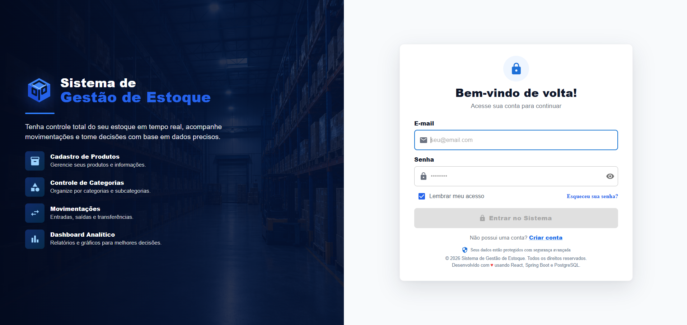
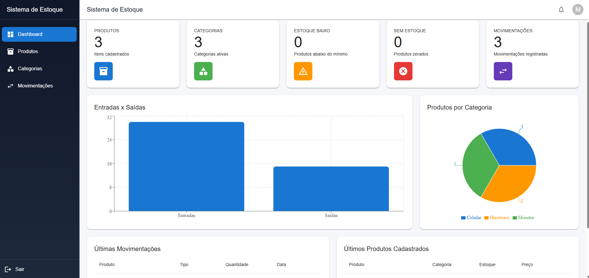
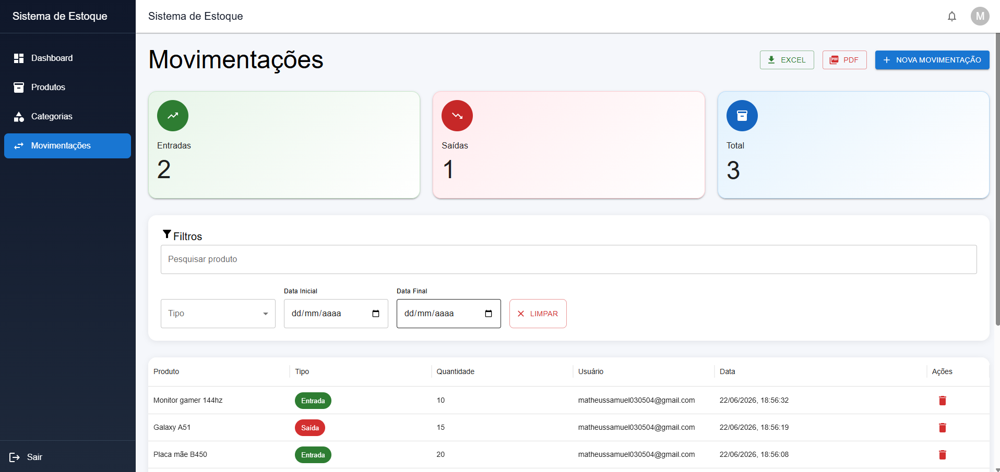
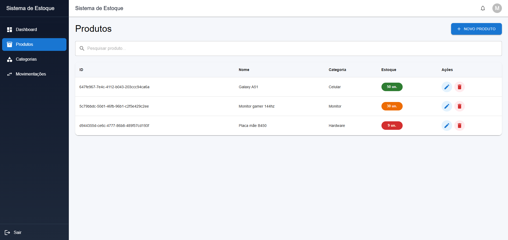

<div align="center">

# 🚀 Sistema de Gestão de Estoque

Sistema web completo para gerenciamento de estoque desenvolvido com **Java Spring Boot**, **React** e **PostgreSQL**.

O objetivo do projeto é permitir o controle de produtos, categorias e movimentações de estoque em tempo real, utilizando autenticação segura, dashboard analítico e persistência em banco de dados em nuvem.

<br>


</div>

---

# 📑 Índice

* 🌐 Aplicação Online
* ⭐ Destaques Técnicos
* 📸 Preview
* ✨ Funcionalidades
* 🏗 Arquitetura
* 🔐 Segurança
* 🛠 Tecnologias Utilizadas
* ⚙️ Executando Localmente
* 🚀 Próximas Evoluções
* 👨‍💻 Autor

---

# 🌐 Demonstração

### 🚀 Aplicação Online

Acesse a versão em produção:

🔗 https://sistema-gestao-estoque-two.vercel.app

---

## 🔗 Repositórios do Projeto

### Frontend (React + Vite)

Interface web responsável pela experiência do usuário.

https://github.com/matheus-samuel-dev/sistema-gestao-estoque

### Backend (Java + Spring Boot)

API REST responsável por autenticação, regras de negócio e persistência de dados.

https://github.com/matheus-samuel-dev/sistema-gestao-estoque-api

---

# ⭐ Destaques Técnicos

✅ Autenticação JWT

✅ Recuperação de senha

✅ Criptografia de senhas com BCrypt

✅ Dashboard com indicadores e gráficos

✅ Controle de produtos e categorias

✅ Registro de entradas e saídas de estoque

✅ Exportação PDF e Excel

✅ API REST documentada com Swagger

✅ Deploy completo (Railway + Vercel)

✅ Interface responsiva para desktop e dispositivos móveis

---

# 📸 Preview

## 🔐 Login



## 📊 Dashboard



## 📈 Movimentações



## 📦 Produtos



---

# ✨ Funcionalidades

## 🔐 Autenticação

* Cadastro de usuários
* Login com JWT
* Recuperação de senha
* Criptografia de senhas com BCrypt
* Rotas protegidas com Spring Security

## 📦 Gestão de Produtos

* Cadastro de produtos
* Atualização de produtos
* Exclusão de produtos
* Consulta de produtos
* Controle de estoque

## 🏷 Gestão de Categorias

* Cadastro de categorias
* Atualização de categorias
* Exclusão de categorias
* Organização dos produtos por categoria

## 📊 Movimentações de Estoque

* Registro de entradas
* Registro de saídas
* Histórico de movimentações
* Atualização automática do estoque
* Controle de usuários responsáveis

## 📈 Dashboard Analítico

* Quantidade de produtos cadastrados
* Categorias ativas
* Produtos sem estoque
* Produtos com estoque baixo
* Gráfico de entradas e saídas
* Distribuição de produtos por categoria
* Últimas movimentações realizadas

---

# 🏗 Arquitetura

O backend segue arquitetura em camadas para garantir organização, manutenção e escalabilidade.

```text
Controller
    ↓
Service
    ↓
Repository
    ↓
PostgreSQL
```

### Estrutura principal

```text
src
├── config
├── security
├── user
├── product
├── category
├── stockmovement
├── dto
├── repository
├── service
└── exception
```

---

# 🔐 Segurança

A autenticação da aplicação utiliza JWT (JSON Web Token).

### Fluxo de autenticação

```text
Usuário
    ↓
Login
    ↓
JWT
    ↓
Requisições Autenticadas
```

### Recursos implementados

* Spring Security
* JWT Authentication
* BCrypt Password Encoder
* Filtros de autenticação
* Rotas públicas e protegidas
* Controle de acesso baseado em autenticação

---

# 🛠 Tecnologias Utilizadas

## Backend

* Java 21
* Spring Boot
* Spring Security
* JWT
* Spring Data JPA
* Hibernate
* Maven

## Frontend

* React
* Vite
* Material UI
* Axios
* React Router

## Banco de Dados

* PostgreSQL

## Deploy

* Railway
* Vercel

## Documentação

* Swagger / OpenAPI

---

# ⚙️ Executando Localmente

```bash
git clone https://github.com/matheus-samuel-dev/sistema-gestao-estoque-api.git

cd sistema-gestao-estoque-api

mvn spring-boot:run
```

Backend disponível em:

```text
http://localhost:8080
```

---

# 🚀 Próximas Evoluções

* [ ] Controle de permissões ADMIN e USER
* [ ] Multiusuário com isolamento de dados
* [ ] Docker
* [ ] Testes unitários com JUnit
* [ ] Testes de integração
* [ ] Pipeline CI/CD
* [ ] Cache com Redis
* [ ] Logs centralizados
* [ ] Auditoria de movimentações
* [ ] Monitoramento e métricas
* [ ] Versionamento de API
* [ ] Exportação avançada de relatórios

---

# 👨‍💻 Autor

## Matheus Samuel Baena Soares

Desenvolvedor de Software com foco em Java, Spring Boot e desenvolvimento de aplicações web.

🌐 Portfólio

https://matheus-samuel-dev.github.io/Portfolio/

💼 LinkedIn

https://www.linkedin.com/in/matheus-samuel-dev/

⭐ Se gostou do projeto, considere deixar uma estrela no repositório.
